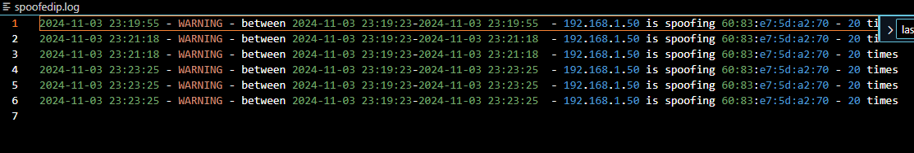

<!-- Improved compatibility of back to top link: See: https://github.com/othneildrew/Best-README-Template/pull/73 -->

<!--
*** Thanks for checking out the Best-README-Template. If you have a suggestion
*** that would make this better, please fork the repo and create a pull request
*** or simply open an issue with the tag "enhancement".
*** Don't forget to give the project a star!
*** Thanks again! Now go create something AMAZING! :D
-->

<!-- PROJECT SHIELDS -->
<!--
*** I'm using markdown "reference style" links for readability.
*** Reference links are enclosed in brackets [ ] instead of parentheses ( ).
*** See the bottom of this document for the declaration of the reference variables
*** for contributors-url, forks-url, etc. This is an optional, concise syntax you may use.
*** https://www.markdownguide.org/basic-syntax/#reference-style-links
-->

<!-- PROJECT LOGO -->
 

    
  </a>

<h3 align="center">project_title</h3>

  

    project_description
    <a href="https://github.com/devBJ-cmd/project/issues/new?labels=bug&template=bug-report---.md">Report Bug</a>
    ·
    <a href="https://github.com/devBJ-cmd/project/issues/new?labels=enhancement&template=feature-request---.md">Request Feature</a>
  

<!-- TABLE OF CONTENTS -->

  
This is a small project that i did for the penetration programming course in python

  <ol>
    <li>
      <a href="#about-the-project">make a program with some various tools that can help in penetration testing </a>
      <ul>
        <li><a href="#built-with">Python</a></li>
      </ul>
    </li>
    <li>
      <a href="#getting-started">Getting Started</a>
      <ul>
        <li><a href="#prerequisites">Python version 3.12.7 and pip </a></li>
        <li><a href="#installation">gh repo clone devBJ-cmd/project pip pip install -r requirements.txt</a></li>
      </ul>
    </li>
    <li><a href="#usage">python project_main.py -mode <c2_client c2_server arp_spoofdetect sublister> </a></li>
    <li><a href="#roadmap">Roadmap</a></li>
    <li><a href="#contributing">Contributing</a></li>
    <li><a href="#license">License</a></li>
    <li><a href="#contact">Contact</a></li>
    <li><a href="#acknowledgments">Acknowledgments</a></li>
  </ol>

<!-- ABOUT THE PROJECT -->
## About The Project
This was a project that i wrote for our programming course in penetratiion testing at ITHS, i decided to write a small c2 that transfer files from the the victim to your host and execute programs on the victiom and recive to your http server that runs on your end, also a small tool for detect arp spoofing with scapy and a tool that uses sublist3r and whois to get info about subdomains 

### Built With

Python and libarys 

<!-- GETTING STARTED -->
## Getting Started
gh repo clone devBJ-cmd/project pip pip install -r requirements.txt

### Installation
2. Clone the repo
  `sh
 gh repo clone devBJ-cmd/project
 pip install -r requirements.txt
  `

<!-- USAGE EXAMPLES -->
## Usage
 
commansds_c2.py contains some options you can do in the encodeing when you for example recive from windows with swedish characters
`-mode c2_client c2_server arp_spoofdetect sublister -tfile -filelist -server_ip -client_ip -crypt_ip -cmd_file -domain -interface  `
-tfile should contain what files to transfer 
-filelist where to save the files 
-server_ip ip of the server
-client ip ip of client
-crypt_ip encryption of the text files that are transfered 
-cmd_file  file that contains what commands to be executed 
-domain should be used sublister 
mode arp_spoofdetect you must specify the -interface 
in windows when running the c2 you need to have elvated privilegies 
the client would accept new connections if you would do python c2_server.py with added at the bottom c2_server('127.0.0.1','test.txt','127.0.0.1')
python project_main.py -domain example.com 
python project_main.py -mode c2_server -tfile test.txt -filelist file_list.txt -server_ip 127.0.0.1 -client_ip 127.0.0.1 -crypt_ip 127.0.0.1  -cmdfile file_commands.txt

 
'
to test the arp spoofer i used 
`sudo bettercap -i eth0 
net.probe on
set arp.spoof.targets 192.168.1.93 
arp.spoof on
`

### Limitations 
with this script the server and client runs on same computer but you could just edit the c2_server.py and c2_client.py to start on separate computers
limitation 

See the [open issues](https://github.com/github_username/repo_name/issues) for a full list of proposed features (and known issues).

<!-- CONTRIBUTING -->
## Contributing

Contributions are what make the open source community such an amazing place to learn, inspire, and create. Any contributions you make are **greatly appreciated**.

If you have a suggestion that would make this better, please fork the repo and create a pull request. You can also simply open an issue with the tag "enhancement".
Don't forget to give the project a star! Thanks again!

1. Fork the Project
2. Create your Feature Branch (`git checkout -b feature/AmazingFeature`)
3. Commit your Changes (`git commit -m 'Add some AmazingFeature'`)
4. Push to the Branch (`git push origin feature/AmazingFeature`)
5. Open a Pull Request

<!-- LICENSE -->
## License

use at it is

<!-- CONTACT -->
## Contact

Project Link: [https://github.com/devBj-cmd/project](https://github.comd/devBJ-cmd/project)

<!-- ACKNOWLEDGMENTS -->
## Acknowledgments
thanks to the great teacher Björn Ettelman
and my great class mates
